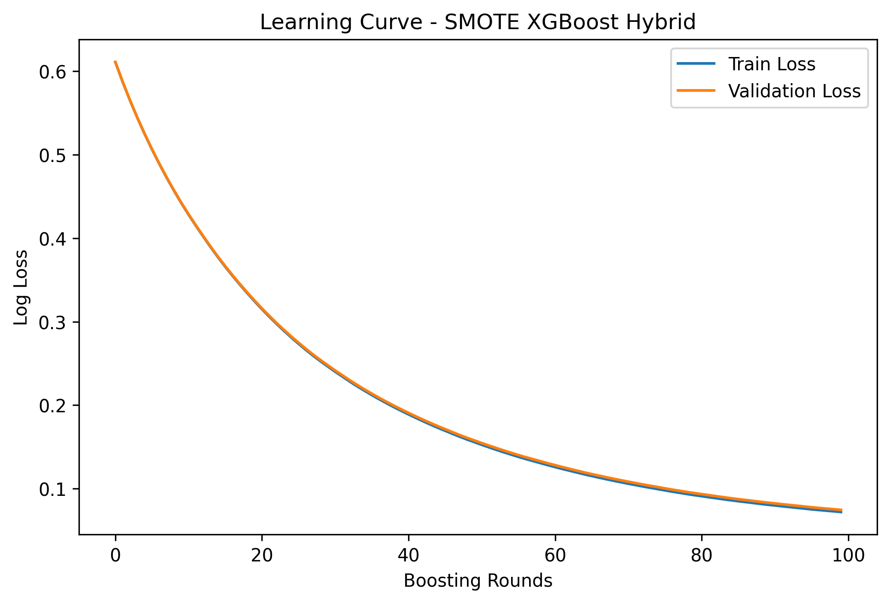

# FraudDetectAI - A Fraud Detection AI  

# Table of Contents
- [Project Overview](#project-overview)
- [Objectives](#objectives)
- [Steps We Have Covered](#steps-we-have-covered)
  - [Exploratory Data Analysis (EDA)](#exploratory-data-analysis-eda)
  - [Data Preprocessing & Feature Engineering](#data-preprocessing--feature-engineering)
  - [Model Training & Evaluation](#model-training--evaluation)
  - [Feature Importance Analysis](#feature-importance-analysis)
  - [Overfitting Analysis](#overfitting-analysis)
  - [SMOTE Adjustment](#smote-adjustment)
- [Final Model Performance](#final-model-performance)
- [Final Learning Curve](#final-learning-curve)
- [Findings So Far](#findings-so-far)
- [Final Steps Before Deployment](#final-steps-before-deployment)
- [Project Structure](#project-structure)
- [Model Download](#model-download)
- [Acknowledgments](#acknowledgments)
- [License](#license)

## Project Overview  
FraudDetectAI is a machine learning-based system designed to **detect fraudulent credit card transactions**.  
Using **imbalanced learning techniques**, feature engineering, and powerful models like **XGBoost**, this project aims to build a **highly accurate fraud detection system**.  

---

## Objectives  
- Understand the nature of fraudulent transactions.  
- Handle **highly imbalanced data** effectively.  
- Build a **robust classification model** for fraud detection.  
- Use **explainability techniques** (SHAP) to interpret model predictions.  

---

## Steps We Have Covered  

### **Exploratory Data Analysis (EDA) ✅ (Completed)**  
🔹 Dataset overview and missing value analysis.  
🔹 Fraud vs. Non-Fraud transaction distribution.  
🔹 Transaction amount & time distribution analysis.  
🔹 PCA feature importance analysis (V1-V28).  
🔹 Identified **top 5 PCA features** for fraud detection.  

### **Data Preprocessing & Feature Engineering ✅ (Completed)**  
🔹 **Feature Scaling** → Standardized all numerical features.  
🔹 **Handling Class Imbalance** → Applied **SMOTE** to balance fraud & non-fraud cases.  
🔹 **Feature Selection** → Verified that all features are useful (none were removed).  
🔹 **Final Dataset Check** → Confirmed dataset shape, missing values, and class distribution.  
🔹 **Final Decision:** **Kept all features** after verifying correlation and importance.  

**Note (March 3, 2025):**  
**The SMOTE model was overfitting.**  
We **adjusted SMOTE ratios** and combined it with **undersampling** to improve generalization.

### **Model Training & Evaluation ✅ (Completed)**  
🔹 **Trained multiple XGBoost models** (Base, Weighted, SMOTE, Hybrid).  
🔹 **Hyperparameter tuning using Optuna**.  
🔹 **Evaluated models using precision-recall, AUC-ROC, and confusion matrices**.  
🔹 **SMOTE XGBoost was overfitting, Hybrid SMOTE fixed this issue.**  

### **Feature Importance Analysis ✅ (Completed)**  
🔹 Used **SHAP (SHapley Additive Explanations)** to analyze model decisions.  
🔹 Generated **SHAP Summary Plot** → Visualizing overall feature impact.  
🔹 Created **SHAP Decision & Waterfall Plots** → Understanding individual fraud predictions.  
🔹 **V4, V14, V12 emerged as key fraud indicators.**  

### **Overfitting Analysis ✅ (Completed)**  
🔹 **Compared Train vs. Test Performance** → Checked precision, recall, F1-score, and AUC-ROC.  
🔹 **Plotted Learning Curves** → Visualized training & validation loss trends.  
🔹 **Confirmed Overfitting in SMOTE XGBoost** → Training loss was nearly **0.0**, but recall was artificially high.  
🔹 **Final Decision:** Modified SMOTE with **Hybrid Sampling** (Oversampling + Undersampling).  

### **SMOTE Adjustment ✅ (Completed)**  
🔹 **Tested multiple SMOTE ratios** (e.g., **70:30, 60:40**) instead of full 1:1 balancing.  
🔹 **Applied Hybrid Sampling** → Combined **undersampling & SMOTE** to prevent overfitting.  
🔹 **Re-trained XGBoost models** → Verified that the new dataset improved performance.  
🔹 **Final Decision:** **Hybrid SMOTE XGBoost is the best-performing model!**  

---

## **Final Model Performance**  
After applying **Hybrid SMOTE (Oversampling + Undersampling)**, the final model achieved the following results:

### **SMOTE Hybrid XGBoost Model Performance:**
| Metric        | Class 0 (Non-Fraud) | Class 1 (Fraud) | Overall    |
|---------------|---------------------|-----------------|------------|
| **Precision** | 0.98                | 0.99            | -          |
| **Recall**    | 1.00                | 0.96            | -          |
| **F1-Score**  | 0.99                | 0.97            | -          |
| **AUC-ROC**   | -                   | -               | **0.9982** |

- **Overfitting has been significantly reduced!**  
- **The model generalizes much better while maintaining high recall!**  

---

## **Final Learning Curve**
The learning curve for the **Hybrid SMOTE XGBoost** model shows **smooth convergence**, meaning the model is no longer overfitting:



---

## Findings So Far  

**EDA Highlights:**  
- **Fraud transactions are extremely rare (0.17%)**, making imbalance handling crucial.  
- Fraud transactions occur **more often at night (1 AM - 6 AM)**.  
- Certain **PCA features (V17, V14, V12, V10, V16) strongly correlate with fraud**.  
- Fraud transactions **tend to have different distributions** in key features.  

**Preprocessing Summary:**  
- **Applied StandardScaler** for feature scaling.  
- **Tested different SMOTE strategies** (Baseline, Weighted, Hybrid).  
- **Hybrid SMOTE (Oversampling + Undersampling) significantly improved model performance.**  
- **Final dataset check passed** → No missing values, dataset is balanced & ready for training.  

**Feature Importance Summary:**  
- **SHAP analysis confirmed that V4, V14, and V12 are key fraud indicators.**  
- **Transaction amount also has a moderate influence** on fraud detection.  
- **Decision plots reveal how fraud risk increases with certain feature values.**  

**Overfitting Summary:**  
- **SMOTE XGBoost was overfitting** (near-zero training loss, high recall but unrealistic performance).  
- **Hybrid SMOTE significantly improved generalization** while maintaining strong fraud detection capability.  

---

## **Final Steps Before Deployment**
1. **Save & document the final model.**  
2. **Prepare for model deployment.**  
3. **Wrap up the project with a final report.**

---

## Project Structure
```
FraudDetectAI/
│── src/
│   ├── datasets/           # Raw and processed datasets
│   ├── models/             # Trained models
│   ├── notebooks/          # Jupyter notebooks for analysis
│   ├── images/             # Saved visualizations
│   ├── reports/            # Project reports & summaries
│── .gitignore              # Ignore the uncessary files
│── README.md               # Project documentation
│── requirements.txt        # Dependencies
```

---

## Model Download  
You can download the trained **XGBoost Hybrid Model** from:  

**GitHub Repository:** [src/models/xgb_hybrid.pkl](https://github.com/otuemre/FraudDetectAI/blob/master/src/models/xgboost_smote_hybrid.pkl)

## Acknowledgments
This project is based on the **Credit Card Fraud Detection dataset** from [mlg-ulb](https://www.kaggle.com/datasets/mlg-ulb/creditcardfraud).

## License
This project is licensed under the **MIT License** - see the [LICENSE](LICENSE.md) file for details.
